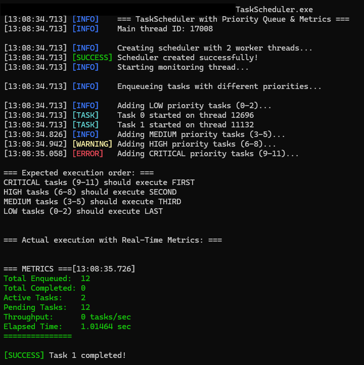
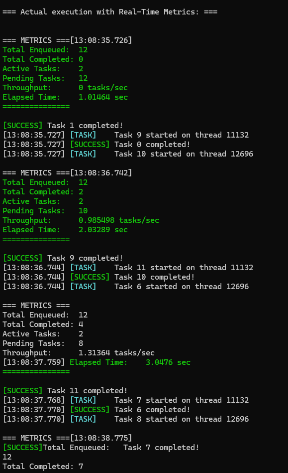
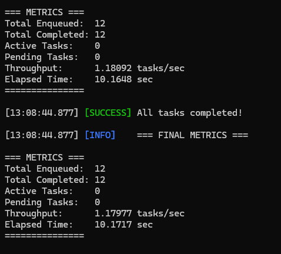

# 🚀 TaskScheduler - High-Performance C++ Thread Pool

A production-ready task scheduler implementation in C++ using WinAPI primitives, featuring priority-based scheduling, real-time metrics, and professional logging.


## ✨ Features

### Core Functionality
- ⚡ **Thread Pool Architecture** - Configurable number of worker threads
- 🎯 **Priority-Based Scheduling** - 4 priority levels (LOW, MEDIUM, HIGH, CRITICAL)
- 🔒 **Thread-Safe Queue** - Lock-free operations using WinAPI primitives
- 📊 **Real-Time Metrics** - Live performance monitoring and throughput tracking
- 🎨 **Professional Logging** - Color-coded, timestamped output
- 🛡️ **Graceful Shutdown** - Proper cleanup and thread lifecycle management
- 🛑 **Task Cancellation** - Cancel pending tasks before execution (dynamic linked list)
- 🔮 **Future/Promise Pattern** - Async task execution with typed return values
- 📈 **Benchmark Suite** - Performance analysis with thread/task scaling tests

### Technical Highlights
- **No STL Dependencies** - Custom implementations of Queue and PriorityQueue
- **WinAPI Integration** - CRITICAL_SECTION, CONDITION_VARIABLE, CreateThread
- **Atomic Operations** - Thread-safe counters using InterlockedXxx
- **High-Precision Timing** - QueryPerformanceCounter for accurate metrics
- **Producer-Consumer Pattern** - Efficient task distribution

## 📸 Screenshots

### Startup & Task Enqueueing


*Color-coded logging with millisecond-precision timestamps*

### Real-Time Execution


*Live metrics showing active tasks, throughput, and completion status*

### Final Results


*Complete performance statistics and priority ordering verification*

## 🛠️ Building the Project

### Prerequisites
- **Windows OS** (uses WinAPI)
- **MSVC Compiler** (Visual Studio or Developer Command Prompt)

### Compilation

**Using MSVC:**
```bash
cl /EHsc main.cpp /Fe:TaskScheduler.exe
```

**Run:**
```bash
TaskScheduler.exe
```

## 🎯 Usage Example
```cpp
#include "TaskScheduler.h"
#include "Logger.h"

void MyTask(void* arg) {
    int taskId = *(int*)arg;
    globalLogger.task("Processing task...");
    // do work here
    globalLogger.success("Task completed!");
}

int main() {
    // create scheduler with 4 worker threads
    TaskScheduler scheduler(4);
    
    // enqueue tasks with different priorities
    int taskId = 1;
    scheduler.enqueueTask(MyTask, &taskId, CRITICAL, 1);
    scheduler.enqueueTask(MyTask, &taskId, HIGH, 2);
    scheduler.enqueueTask(MyTask, &taskId, MEDIUM, 3);
    scheduler.enqueueTask(MyTask, &taskId, LOW, 4);
    
    // tasks execute in priority order: CRITICAL → HIGH → MEDIUM → LOW
    
    Sleep(5000); // wait for completion
    
    // print metrics
    scheduler.getMetrics().printStats();
    
    return 0;
}
```

## 📊 Performance Metrics

The scheduler tracks:
- **Total Tasks Enqueued** - Total number of tasks submitted
- **Total Tasks Completed** - Successfully executed tasks
- **Active Tasks** - Currently running tasks
- **Pending Tasks** - Tasks waiting in queue
- **Throughput** - Tasks completed per second
- **Elapsed Time** - Total runtime

## 🏗️ Architecture

### Components
```
TaskScheduler/
├── Queue.h              # Basic FIFO queue implementation
├── ThreadSafeQueue.h    # Thread-safe queue with mutex/CV
├── PriorityQueue.h      # Priority-based sorted queue
├── TaskScheduler.h      # Main scheduler with thread pool
├── Metrics.h            # Performance tracking system
├── Logger.h             # Timestamped, color-coded logging
├── Future.h             # Future/Promise pattern for async results
├── Benchmark.h          # Performance benchmark suite
└── main.cpp             # Demo & test application
```

### Task Flow
```
User Thread                Worker Threads
    |                           |
    | enqueueTask()            |
    ├──────────────►[Priority  |
    |               Queue]     |
    |                  │       |
    |                  ▼       |
    |              dequeue() ◄─┤
    |                  │       |
    |                  ▼       |
    |              execute()   |
    |                  │       |
    |                  ▼       |
    |           taskCompleted()|
    |                  │       |
    |                  ▼       |
    |            [Metrics]     |
```

## 🎓 What I Learned

### Concurrency Concepts
- Thread synchronization using CRITICAL_SECTION
- Condition variables for producer-consumer pattern
- Atomic operations with InterlockedXxx
- Deadlock prevention and thread safety

### WinAPI Programming
- CreateThread & thread lifecycle management
- WaitForMultipleObjects for synchronization
- Console color manipulation
- High-resolution timers

### Design Patterns
- Producer-Consumer pattern
- Thread Pool pattern
- Priority Queue with sorted insertion
- RAII for resource management

### Performance Engineering
- Lock-free counters for metrics
- Minimal critical section scope
- Efficient task distribution
- Real-time monitoring

## 🚧 Future Improvements

- [ ] **Task Dependencies** - DAG-based task execution order
- [x] **Return Values** - Future/Promise pattern for async results
- [ ] **Dynamic Thread Pool** - Auto-scaling based on load
- [x] **Task Cancellation** - Ability to cancel pending tasks
- [ ] **Configuration File** - JSON/INI for scheduler settings
- [ ] **Cross-Platform Support** - Abstraction layer for Linux/macOS
- [ ] **Work Stealing** - Load balancing between threads
- [x] **Benchmark Suite** - Performance comparison tests

## 📝 Technical Details

### Priority System
```cpp
enum TaskPriority {
    LOW = 0,      // Background tasks
    MEDIUM = 1,   // Normal priority (default)
    HIGH = 2,     // Important tasks
    CRITICAL = 3  // Urgent, execute first
};
```

### Logging Levels
```cpp
enum LogLevel {
    LOG_INFO,     // General information (blue)
    LOG_WARNING,  // Warnings (yellow)
    LOG_ERROR,    // Errors (red)
    LOG_SUCCESS,  // Success messages (green)
    LOG_TASK      // Task execution (cyan)
};
```

## 🤝 Contributing

This is a learning project, but suggestions and improvements are welcome!

## 📄 License

MIT License - feel free to use this code for learning purposes.

## 👨‍💻 Author

**IsxImattI**

## 🙏 Acknowledgments

- Inspired by production task schedulers in game engines and async frameworks
- Built without STL to understand low-level concurrency primitives
- Special thanks to the C++ and WinAPI documentation

---

⭐ **If you found this helpful, please star the repo!**

Built with ❤️ and lots of coffee ☕